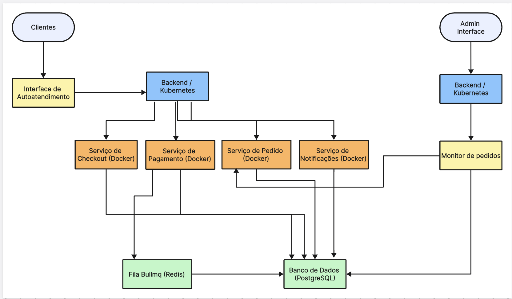

# FIAP Tech Challenge 7SOAT - Tech Challenge #2

## Group #49 - Members

- Felipe José Cardoso de Sousa (Discord: **Felipe Sousa - RM355595**)
- Robson Batista da Silva (Discord: **Robson - RM356014**)
- Vinicius Pereira (Discord: **Vinicius Pereira - RM355809**)
- Henrique Perez Bego (Discord: **Henrique Bego - RM354844**)
- Breno Silva Sobral (Discord: **Breno - RM355234**)

## Business Process 

[Miro Link](https://miro.com/app/board/uXjVKVo2egw=/)

[GitHub Link](https://github.com/TechChallenge-BFHRV/tech-clean-arch)

## Business Requirements

A lanchonete precisa de um sistema de controle de pedidos para evitar confusões e garantir a eficiência no atendimento. A lanchonete irá investir em um sistema de autoatendimento de fast food, que é composto por uma série de dispositivos e interfaces que permitem aos clientes selecionar e fazer pedidos sem precisar interagir com um atendente.

## Infrastructure Requirements 

- Docker and Docker Compose
- Orquestração com Kubernetes

## Technologies
- Docker
- Fastify and NestJS
- Prisma
- Jest
- PostgreSQL
- Kubernetes
- Bullmq
- Logging with Winston
- Prettier (Code formatter), ESLint (Linter)

## Architectural Drawing

[Diagrama de Arquitetura](https://boardmix.com/app/share/CAE.CMeILiABKhBUeKNWQzzjVi9r4H6er7h7MAZAAQ/KVN6mY%EF%BC%8C)

## Documentation

Project structured with Clean Architecture, minding good practices and SOLID principles

## API Collection

API documentation is available at [Local API Docs](http://localhost:3000/docs) once the project is running.

## Getting started

To run the TECH-BACKEND project on your local machine, follow these steps:

1. **Environment Setup**: Create a `.env` file based on the provided `.env.example` template.
2. **Install Dependencies**: Run `yarn install` to install required dependencies.
3. **Build Containers**: Use `docker-compose build` to build the Docker containers.
4. **Start Containers**: Execute `docker-compose up -d` to start the containers in detached mode.
6. **Application Access**: It’ll be launched at http://localhost:3000.
7. **Endpoint Collections**: The Postman endpoint collections are located at /docs in the root project directory.

You can import all endpoint configurations from the `/docs` folder into Postman for API testing.

## Demo Video

[Vídeo de Demonstração](https://vimeo.com/992555215?share=copy)

## Azure AKS deployment

You need to have the Azure CLI installed in your local environment.

1. Use your credentials to log in to your azure account
2. Ensure you're logged in requesting your AKS containers in Azure with: `az aks list`
3. If you receive a successful response, continue, otherwise make sure you're connected to the Azure CLI
4. Run `terraform apply`
5. Wait patiently
6. Run `echo "$(terraform output kube_config)" > ./azurek8s`
7. Ensure your new `azurek8s` file does not have any "EOT" strings in it. If it does, remove the lines where they appear
8. Run `export KUBECONFIG=./azurek8s`
9. Run `kubectl get nodes` to ensure kubernetes is running properly on AKS. You should see a machine listed in your terminal with Ready STATUS.
10. Run `kubectl apply -f k8s/postgres-deployment.yaml`
11. Run `kubectl apply -f k8s/redis-deployment.yaml`
12. Run `kubectl apply -f k8s/deployment.yaml`
13. Run `kubectl apply -f k8s/service.yaml`
14. Run `kubectl get svc` and use the `EXTERNAL-IP` address of the `techchallenge-k8s LoadBalancer` in the following format: `external-ip-numbers:3000/docs` in your browser
15. You are now accessing the cleanarch-techchallenge Swagger

