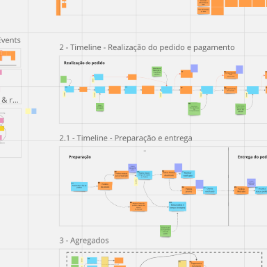

# FIAP Tech Challenge 7SOAT - Tech Challenge #2

## Business Process

[Miro Link](https://miro.com/app/board/uXjVKVo2egw=/)

[GitHub Link](https://github.com/TechChallenge-BFHRV/tech-backend)

## Introduction

Development of an Order system for a restaurant developed with TypeScript, NestJS, Prisma and PostgreSQL.

## Members

- Felipe José Cardoso de Sousa (Discord: **Felipe Sousa - RM355595**)
- Robson Batista da Silva (Discord: **Robson - RM356014**)
- Vinicius Pereira (Discord: **Vinicius Pereira - RM355809**)
- Henrique Perez Bego (Discord: **Henrique Bego - RM354844**)
- Breno Silva Sobral (Discord: **Breno - RM355234**)

## Technologies

- Docker
- Fastify and NestJS
- Prisma
- Jest
- PostgreSQL
- Logging with Winston
- Prettier (Code formatter), ESLint (Linter)

## Requirements

- Docker and Docker Compose

## Documentation

API documentation is available at [Local API Docs](http://localhost:3000/docs) once the project is running.

## Getting started

To run the TECH-BACKEND project on your local machine, follow these steps:

1. **Environment Setup**: Create a `.env` file based on the provided `.env.example` template.
2. **Install Dependencies**: Run `yarn install` to install required dependencies.
3. **Build Containers**: Use `docker-compose build` to build the Docker containers.
4. **Start Containers**: Execute `docker-compose up -d` to start the containers in detached mode.
6. **Application Access**: It’ll be launched at http://localhost:3000.
7. **Endpoint Collections**: The Postman endpoint collections are located at /docs in the root project directory.

You can import all endpoint configurations from the `/docs` folder into Postman for API testing.

